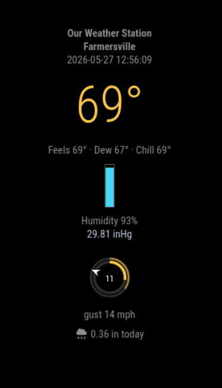

# MMM-PWSWeather

A [MagicMirror²](https://github.com/MagicMirrorOrg/MagicMirror) module that displays real-time weather data from your __Personal Weather Station__ at [Weather Underground](https://www.wunderground.com).
The **provider** can be used by the default weather module and other weather modules that support the `weatherProvider` configuration option.

**Requires MagicMirror² v2.35.0+** for the weather provider (server-side provider API).

## Screenshot


## Features

- Real-time weather data from Weather Underground Personal Weather Stations
- Provider can be used with the built-in weather module
- Comprehensive weather information including:
  - Current temperature with feels-like temperature
  - Dew point and wind chill
  - Humidity and barometric pressure
  - Wind speed, gusts, and direction (compass abbreviation)
  - Precipitation rate and daily total
  - UV Index and solar radiation (when available)
  - Station location and elevation
  - Last observation time

## Install

```bash
cd ~/MagicMirror/modules/
git clone https://github.com/msimon360/MMM-PWSWeather
cd MMM-PWSWeather
npm install
```

## Use Provider Only

Weather providers in MagicMirror² v2.35.0+ run as **server-side Node.js classes**. Copy the provider into MagicMirror's built-in weather providers directory:

```bash
cp ~/MagicMirror/modules/MMM-PWSWeather/pws.js \
  ~/MagicMirror/defaultmodules/weather/providers/
```

Then configure the weather module:

```javascript
{
  module: "weather",
  position: "top_right",
  config: {
    weatherProvider: "pws",
    type: "current",
    apiKey: "your-weather-underground-api-key",
    stationId: "your-station-ID",
    units: "e",              // PWS API request units: e=imperial, m=metric, h=uk hybrid
    updateInterval: 300000   // 5 minutes
  }
}
```

> **Note:** The weather module always consumes metric values (Celsius, m/s, mm). This provider converts from the PWS response automatically. The `units` option only controls which unit system the Weather Underground API returns.

Only `type: "current"` is supported (PWS current observations do not include forecasts).

To keep git from overwriting a custom provider on MagicMirror updates:

```bash
git -C ~/MagicMirror update-index --assume-unchanged \
  defaultmodules/weather/providers/pws.js
```

## Configuration (standalone module)

Add the module to your `config/config.js` file:

```javascript
{
  module: "MMM-PWSWeather",
  position: "top_right",
  config: {
    apiKey: "your-weather-underground-api-key",
    stationId: "your-station-ID",
    updateInterval: 300000,     // Update every 5 minutes (in milliseconds)
  }
}
```

## Configuration Options

| Option | Description | Default | Required |
|--------|-------------|---------|----------|
| `apiKey` | Your Weather Underground API key | - | **Yes** |
| `stationId` | Your Weather Underground station ID | - | **Yes** |
| `updateInterval` | How often to fetch new data (milliseconds) | `300000` (5 min) | No |
| `units` | PWS API units (`e`, `m`, or `h`). Provider converts to metric for the weather module. | `e` | No |

## Getting a Weather Underground API Key
If you have a Personal Weather Station that reports to Weather Underground
you can get an API key with your FREE account. You can also get an API key
with a paid subscription to pull data from other Weather Stations.

1. Go to [Weather Underground](https://www.wunderground.com/)
2. Sign up or log in to your account
3. Visit the [API Keys page](https://www.wunderground.com/member/api-keys)
4. Create a new API key
5. Copy the 32-character key into your config

**Important:** Make sure you copy all 32 characters of the API key. Missing even one character will cause a 401 authentication error.

## Finding Your Station ID

1. Go to [Weather Underground](https://www.wunderground.com/)
2. Search for your location
3. Find your chosen weather station on the map
4. Click on it to see the Station ID (format: `KSSCCCCNNN` where SS is state, CCCC is city, NNN is number)

## Troubleshooting

### "PWS Weather error: Request failed with status code 401"

This means your API key is invalid or incorrectly entered. Check that:
- Your API key is exactly 32 characters
- There are no extra spaces or quotes in the config
- Your API key is still active on Weather Underground

### Module shows "Loading PWS weather..." but never updates

- Verify your station ID is correct
- Check that your station is actively reporting data
- Look at the console output with `npm start` for error messages
- Ensure your Raspberry Pi has internet connectivity

### No data displaying

- Confirm your station is online and reporting
- Try a different nearby station ID to test
- Check the MagicMirror logs for JavaScript errors

### Provider fails after upgrading MagicMirror to v2.35.0

MagicMirror v2.35.0 removed the client-side `WeatherProvider.register(...)` API. Re-copy `pws.js` from this module (v2.0.0+) into `defaultmodules/weather/providers/` and restart MagicMirror.

## License

MIT License - feel free to use and modify as needed.

## Credits

Developed for MagicMirror² using Weather Underground API.

## Contributing

Pull requests and suggestions are welcome!
